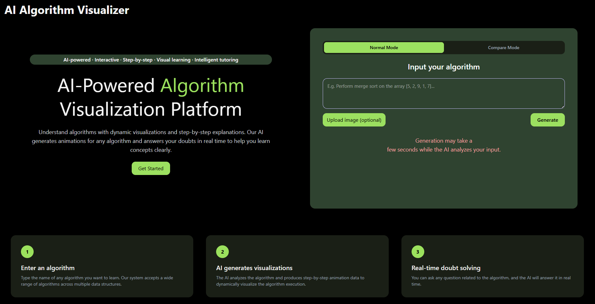
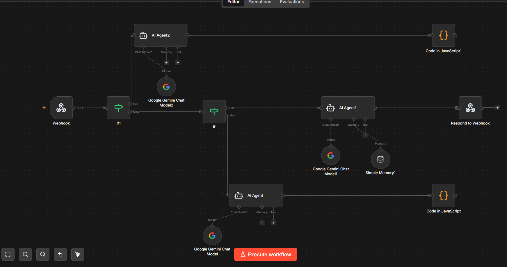

# 🔍 Algorithm Visualizer

An AI-driven multi-agent web application that dynamically generates step-by-step algorithm visualizations from any user input — text, description, or image. Built with React.js, Konva.js, Node.js, and n8n, it helps students understand algorithms through interactive visuals, pseudocode, and a real-time doubt-resolution chatbot.


---

## ✨ Features

- **AI-Powered Visualizations** — Enter any algorithm by name, description, or image and the AI agent automatically generates a structured visualization
- **Algorithm-Agnostic** — Not limited to pre-programmed algorithms; the system classifies and visualizes any input the user provides
- **Single & Comparison Mode** — Visualize one algorithm, or compare two side by side to analyze differences in execution
- **Step-by-Step Explanations** — Each visualization step comes with contextual explanations and pseudocode
- **Context-Aware Chatbot** — Ask questions at any step; the AI agent resolves doubts based on the current visualization context using a RAG-like approach
- **Seven Visualization Types** — Linear, tree, graph, grid, state, stack, and custom rendering via Konva.js
- **Flexible Input** — Accepts algorithm names, text descriptions, problem statements, or images

---

## 🛠️ Tech Stack

| Layer      | Technology                                |
|------------|-------------------------------------------|
| Frontend   | React.js, Konva.js, JavaScript, CSS       |
| Backend    | Node.js, Express.js                       |
| Automation | n8n (self-hosted workflow engine)         |
| AI Layer   | AI Agent (via n8n), LLM-based JSON output |
| Rendering  | HTML5 Canvas (via Konva.js)               |

---

## 📁 Project Structure

```
Algorithm-Visualizer/
├── Frontend/           # React application
│   ├── src/
│   │   ├── components/ # Reusable UI components
│   │   ├── pages/      # Page-level views
│   │   └── ...
│   └── package.json
├── Backend/            # Node.js + Express API server
│   └── ...
└── README.md
```

---


## ⚙️ Use of n8n

This project uses **[n8n](https://n8n.io/)** as the core workflow automation engine that powers the AI intelligence behind the visualizations.

n8n is self-hosted and acts as the bridge between the frontend, backend, and AI agents. Here's how it fits into the system:

- **Webhook Trigger** — The Express.js backend sends a POST request to an n8n webhook whenever a user submits an algorithm input
- **AI Agent Node** — An AI agent inside the n8n workflow analyzes the input and produces a structured JSON response containing the algorithm name, description, pseudocode, visualization type, data structure representation, and step-by-step execution plan
- **Visualization Routing** — The agent automatically classifies the algorithm into one of seven types (`linear`, `tree`, `graph`, `grid`, `state`, `stack`, `custom`), eliminating the need to hardcode each algorithm
- **Chatbot Integration** — A separate n8n workflow handles real-time doubt resolution via the `/api/chat` endpoint, using context-aware responses similar to Retrieval-Augmented Generation (RAG)
- **Respond to Webhook** — The processed JSON is returned to the backend, which passes it to the React frontend for rendering via Konva.js

This architecture makes the platform **algorithm-agnostic** — it can generate visualizations for any algorithm the user provides, without pre-programmed logic for each one.

---

## 🧠 Algorithms Covered

The platform supports **any algorithm** the user provides — it is not limited to a predefined list. The AI agent dynamically generates visualizations using one of seven rendering strategies:

| Visualization Type | Used For |
|--------------------|----------|
| `linear`  | Arrays, sequences, searching algorithms |
| `tree`    | Binary trees, recursion trees |
| `graph`   | Graph traversal, shortest path (e.g. Dijkstra's) |
| `grid`    | Grid-based pathfinding, maze problems |
| `state`   | State machine algorithms |
| `stack`   | Stack-based algorithms (e.g. Towers of Hanoi) |
| `custom`  | Any algorithm not covered by the above types |

**Tested examples include:** Dijkstra's Shortest Path, Towers of Hanoi, and other graph and recursive problems.

---

## 📊 Performance

Evaluated across 15 different algorithm inputs:

| Metric                     | Value    |
|----------------------------|----------|
| Average Response Time      | 40.0 sec |
| Visualization Accuracy     | 93%      |
| Visualization Completeness | 85%      |
| Error Rate                 | 15%      |

---

## 📸 Screenshots


### Landing page of the website:


### N8N Workflow used:


---

## 🚀 Getting Started

### Prerequisites

- [Node.js](https://nodejs.org/) v16 or higher
- npm v8 or higher
- A running [n8n](https://n8n.io/) instance (self-hosted) with the workflow configured

### 1. Clone the Repository

```bash
git clone https://github.com/pavankalyan7127/Algorithm-Visualizer.git
cd Algorithm-Visualizer
```

### 2. Start the Backend

```bash
cd Backend
npm install
npm start
```

The backend server will start at `http://localhost:5000` (or as configured).

### 3. Start the Frontend

Open a new terminal:

```bash
cd Frontend
npm install
npm start
```

The React app will open at `http://localhost:3000`.

---


## 🤝 Contributing

Contributions are welcome! Here's how to get started:

1. Fork the repository
2. Create a new branch: `git checkout -b feature/your-feature-name`
3. Commit your changes: `git commit -m "Add your feature"`
4. Push to your branch: `git push origin feature/your-feature-name`
5. Open a Pull Request

---

## 📄 License

This project is open source and available under the [MIT License](LICENSE).

---

## 👤 Authors

**Pavan Kalyan K** — [@pavankalyan7127](https://github.com/pavankalyan7127)


---

> ⭐ If you found this project helpful, give it a star on GitHub!
